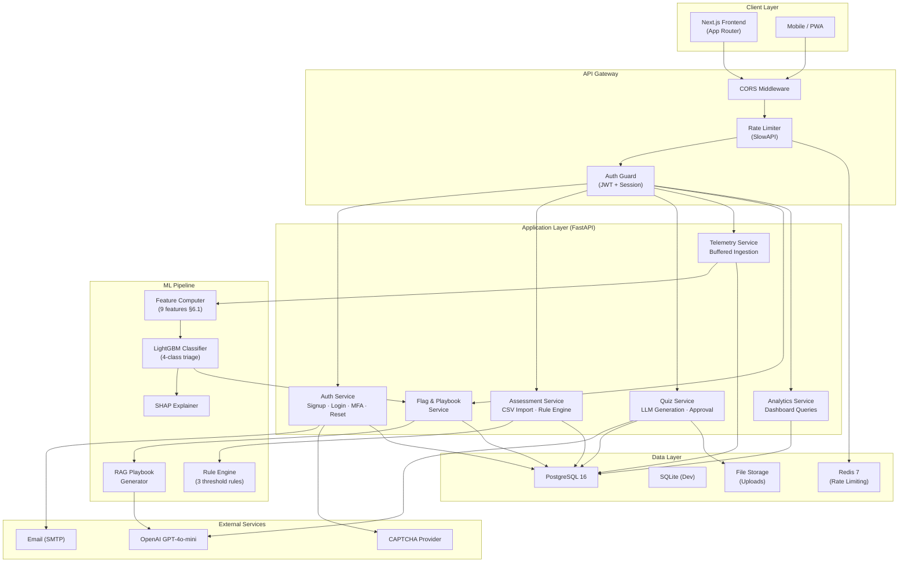
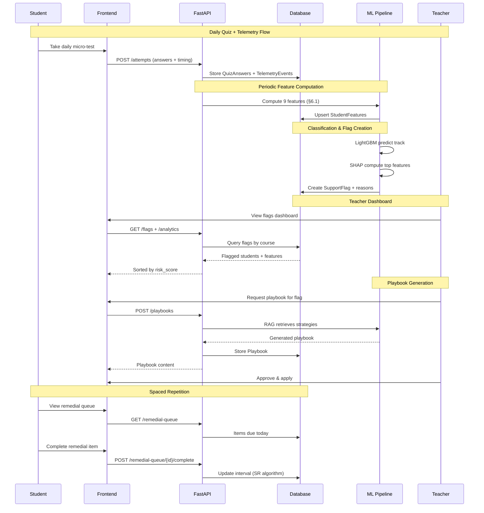

# EdCap — System Architecture

```mermaid
graph TB
    subgraph "Client Layer"
        FE["Next.js Frontend<br/>(App Router)"]
        MOB["Mobile / PWA"]
    end

    subgraph "API Gateway"
        CORS["CORS Middleware"]
        RL["Rate Limiter<br/>(SlowAPI)"]
        AUTH["Auth Guard<br/>(JWT + Session)"]
    end

    subgraph "Application Layer (FastAPI)"
        direction TB
        AUTH_SVC["Auth Service<br/>Signup · Login · MFA · Reset"]
        ASSESS_SVC["Assessment Service<br/>CSV Import · Rule Engine"]
        QUIZ_SVC["Quiz Service<br/>LLM Generation · Approval"]
        TEL_SVC["Telemetry Service<br/>Buffered Ingestion"]
        FLAG_SVC["Flag & Playbook<br/>Service"]
        ANALYTICS["Analytics Service<br/>Dashboard Queries"]
    end

    subgraph "ML Pipeline"
        FEAT["Feature Computer<br/>(9 features §6.1)"]
        RULE["Rule Engine<br/>(3 threshold rules)"]
        LGBM["LightGBM Classifier<br/>(4-class triage)"]
        SHAP_E["SHAP Explainer"]
        RAG["RAG Playbook<br/>Generator"]
    end

    subgraph "Data Layer"
        PG["PostgreSQL 16"]
        SQLITE["SQLite (Dev)"]
        REDIS["Redis 7<br/>(Rate Limiting)"]
        FS["File Storage<br/>(Uploads)"]
    end

    subgraph "External Services"
        LLM["OpenAI GPT-4o-mini"]
        EMAIL["Email (SMTP)"]
        CAPTCHA["CAPTCHA Provider"]
    end

    FE --> CORS
    MOB --> CORS
    CORS --> RL --> AUTH
    AUTH --> AUTH_SVC
    AUTH --> ASSESS_SVC
    AUTH --> QUIZ_SVC
    AUTH --> TEL_SVC
    AUTH --> FLAG_SVC
    AUTH --> ANALYTICS

    ASSESS_SVC --> RULE
    TEL_SVC --> FEAT
    FEAT --> LGBM
    LGBM --> SHAP_E
    LGBM --> FLAG_SVC
    FLAG_SVC --> RAG

    QUIZ_SVC --> LLM
    RAG --> LLM
    AUTH_SVC --> EMAIL
    AUTH_SVC --> CAPTCHA

    AUTH_SVC --> PG
    ASSESS_SVC --> PG
    QUIZ_SVC --> PG
    TEL_SVC --> PG
    FLAG_SVC --> PG
    ANALYTICS --> PG
    RL --> REDIS
    QUIZ_SVC --> FS
```

---

# Data Flow — Student Triage Pipeline

```mermaid
sequenceDiagram
    participant S as Student
    participant FE as Frontend
    participant API as FastAPI
    participant DB as Database
    participant ML as ML Pipeline
    participant T as Teacher

    Note over S,T: Daily Quiz + Telemetry Flow
    S->>FE: Take daily micro-test
    FE->>API: POST /attempts (answers + timing)
    API->>DB: Store QuizAnswers + TelemetryEvents
    
    Note over API,ML: Periodic Feature Computation
    API->>ML: Compute 9 features (§6.1)
    ML->>DB: Upsert StudentFeatures

    Note over ML,DB: Classification & Flag Creation
    ML->>ML: LightGBM predict track
    ML->>ML: SHAP compute top features
    ML->>DB: Create SupportFlag + reasons

    Note over DB,T: Teacher Dashboard
    T->>FE: View flags dashboard
    FE->>API: GET /flags + /analytics
    API->>DB: Query flags by course
    DB-->>API: Flagged students + features
    API-->>FE: Sorted by risk_score

    Note over T,ML: Playbook Generation
    T->>FE: Request playbook for flag
    FE->>API: POST /playbooks
    API->>ML: RAG retrieves strategies
    ML-->>API: Generated playbook
    API->>DB: Store Playbook
    API-->>FE: Playbook content
    T->>FE: Approve & apply

    Note over S,DB: Spaced Repetition
    S->>FE: View remedial queue
    FE->>API: GET /remedial-queue
    API->>DB: Items due today
    S->>FE: Complete remedial item
    FE->>API: POST /remedial-queue/{id}/complete
    API->>DB: Update interval (SR algorithm)
```
