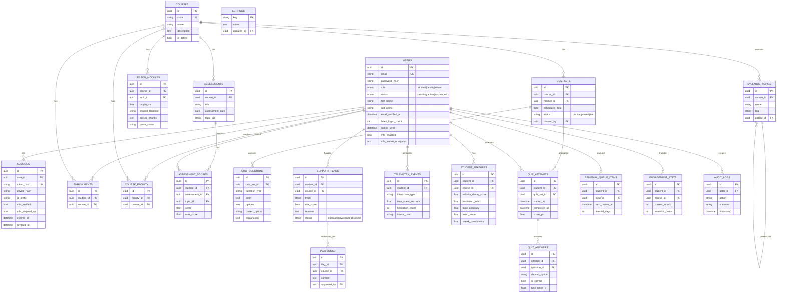

# EdCap — Entity Relationship Diagram

```mermaid
erDiagram
    USERS {
        uuid id PK
        string email UK
        string password_hash
        enum role "student|faculty|admin"
        enum status "pending|active|suspended"
        string first_name
        string last_name
        datetime email_verified_at
        int failed_login_count
        datetime locked_until
        bool mfa_enabled
        text mfa_secret_encrypted
    }
    SESSIONS {
        uuid id PK
        uuid user_id FK
        string token_hash UK
        string device_hash
        string ip_prefix
        bool mfa_verified
        bool mfa_stepped_up
        datetime expires_at
        datetime revoked_at
    }
    COURSES {
        uuid id PK
        string code UK
        string name
        text description
        bool is_active
    }
    ENROLLMENTS {
        uuid id PK
        uuid student_id FK
        uuid course_id FK
    }
    COURSE_FACULTY {
        uuid id PK
        uuid faculty_id FK
        uuid course_id FK
    }
    SYLLABUS_TOPICS {
        uuid id PK
        uuid course_id FK
        string name
        string tag
        uuid parent_id FK
    }
    LESSON_MODULES {
        uuid id PK
        uuid course_id FK
        uuid topic_id FK
        date taught_on
        string original_filename
        text parsed_chunks
        string parse_status
    }
    ASSESSMENTS {
        uuid id PK
        uuid course_id FK
        string title
        date assessment_date
        string topic_tag
    }
    ASSESSMENT_SCORES {
        uuid id PK
        uuid student_id FK
        uuid assessment_id FK
        uuid topic_id FK
        float score
        float max_score
    }
    QUIZ_SETS {
        uuid id PK
        uuid course_id FK
        uuid module_id FK
        date scheduled_date
        string status "draft|approved|live"
        uuid created_by FK
    }
    QUIZ_QUESTIONS {
        uuid id PK
        uuid quiz_set_id FK
        string question_type
        text stem
        text options
        string correct_option
        text explanation
    }
    QUIZ_ATTEMPTS {
        uuid id PK
        uuid student_id FK
        uuid quiz_set_id FK
        datetime started_at
        datetime completed_at
        float score_pct
    }
    QUIZ_ANSWERS {
        uuid id PK
        uuid attempt_id FK
        uuid question_id FK
        string chosen_option
        bool is_correct
        float time_taken_s
    }
    TELEMETRY_EVENTS {
        uuid id PK
        uuid student_id FK
        string interaction_type
        float time_spent_seconds
        int hesitation_count
        string format_used
    }
    STUDENT_FEATURES {
        uuid id PK
        uuid student_id FK
        uuid course_id FK
        float velocity_decay_score
        float hesitation_index
        float topic_accuracy
        float trend_slope
        float streak_consistency
    }
    SUPPORT_FLAGS {
        uuid id PK
        uuid student_id FK
        uuid course_id FK
        string track
        float risk_score
        text reasons
        string status "open|acknowledged|resolved"
    }
    PLAYBOOKS {
        uuid id PK
        uuid flag_id FK
        uuid course_id FK
        text content
        uuid approved_by FK
    }
    REMEDIAL_QUEUE_ITEMS {
        uuid id PK
        uuid student_id FK
        uuid topic_id FK
        datetime next_review_at
        int interval_days
    }
    ENGAGEMENT_STATS {
        uuid id PK
        uuid student_id FK
        uuid course_id FK
        int current_streak
        int retention_points
    }
    AUDIT_LOGS {
        uuid id PK
        uuid actor_id FK
        string action
        string outcome
        datetime timestamp
    }
    SETTINGS {
        string key PK
        text value
        uuid updated_by FK
    }

    USERS ||--o{ SESSIONS : "has"
    USERS ||--o{ ENROLLMENTS : "enrolls"
    USERS ||--o{ COURSE_FACULTY : "teaches"
    COURSES ||--o{ ENROLLMENTS : "has"
    COURSES ||--o{ COURSE_FACULTY : "has"
    COURSES ||--o{ SYLLABUS_TOPICS : "contains"
    COURSES ||--o{ LESSON_MODULES : "has"
    COURSES ||--o{ ASSESSMENTS : "has"
    COURSES ||--o{ QUIZ_SETS : "has"
    SYLLABUS_TOPICS ||--o{ SYLLABUS_TOPICS : "parent-child"
    ASSESSMENTS ||--o{ ASSESSMENT_SCORES : "has"
    USERS ||--o{ ASSESSMENT_SCORES : "scores"
    QUIZ_SETS ||--o{ QUIZ_QUESTIONS : "contains"
    QUIZ_SETS ||--o{ QUIZ_ATTEMPTS : "attempted"
    USERS ||--o{ QUIZ_ATTEMPTS : "attempts"
    QUIZ_ATTEMPTS ||--o{ QUIZ_ANSWERS : "answers"
    USERS ||--o{ TELEMETRY_EVENTS : "generates"
    USERS ||--o{ STUDENT_FEATURES : "has"
    USERS ||--o{ SUPPORT_FLAGS : "flagged"
    SUPPORT_FLAGS ||--o{ PLAYBOOKS : "addressed_by"
    USERS ||--o{ REMEDIAL_QUEUE_ITEMS : "queued"
    USERS ||--o{ ENGAGEMENT_STATS : "tracked"
    USERS ||--o{ AUDIT_LOGS : "creates"
```
